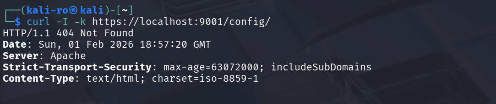

# Práctica 3.1.1.1: Hardening de Servidor Apache y Cifrado SSL

En esta práctica se implementa un servidor web **Apache** bajo **Debian Bookworm**, aplicando técnicas de hardening para minimizar la superficie de exposición y configurando comunicaciones seguras mediante **SSL/TLS**.

## 1. Estructura del directorio

El proyecto organiza las configuraciones de seguridad y los activos certificados de manera independiente:

```text
RA3_1_1_1/
├── config/                 
│   ├── hardening.conf      
│   └── sitio-ssl.conf      
├── ssl/                   
│   ├── mi_certificado.crt 
│   └── mi_clave.key      
├── .dockerignore
├── Dockerfile             
└── README.md              
```

## 2. Archivos de configuración

### 2.1. Servidor Apache (hardening.conf)

Se configura el servidor para restringir la información enviada al cliente y forzar políticas de seguridad:

* **ServerTokens Prod & ServerSignature Off:** Oculta la versión de Apache y el SO en las cabeceras para evitar el reconocimiento del sistema por parte de atacantes.
* **HSTS (Strict-Transport-Security):** Implementa una política de transporte seguro que obliga al navegador a usar HTTPS durante 2 años.
* **CSP (Content Security Policy):** Define orígenes de confianza para el contenido, mitigando ataques de XSS e inyección de datos.

### 2.2. Sitio SSL (sitio-ssl.conf)

Define el VirtualHost en el puerto 443, vinculando los certificados generados y activando el motor de cifrado SSL.

## 3. Dockerfile

```dockerfile
# Usamos Debian Bookworm una versión más ligera de Debian
FROM debian:bookworm-slim

# 1. Actualizar e instalar Apache y utilidades básicas
RUN apt-get update && \
    apt-get install -y apache2 curl openssl && \
    apt-get clean && \
    rm -rf /var/lib/apt/lists/*

# 2. Preparar el directorio de certificados
RUN mkdir -p /etc/apache2/ssl

# 3. Copiar nuestros certificados
COPY ssl/mi_certificado.crt /etc/apache2/ssl/
COPY ssl/mi_clave.key /etc/apache2/ssl/

# 3. Copiar nuestras configuraciones
COPY config/hardening.conf /etc/apache2/conf-available/hardening.conf
COPY config/sitio-ssl.conf /etc/apache2/sites-available/sitio-ssl.conf

# 4. APLICAR HARDENING Y CONFIGURACIÓN
RUN a2enmod ssl headers
RUN a2enconf hardening
RUN a2disconf security
RUN a2ensite sitio-ssl
RUN a2dismod -f autoindex

# 5. Exponer puertos
EXPOSE 80 443

# 6. Arrancar Apache
CMD ["apache2ctl", "-D", "FOREGROUND"]
```

## 4. Guía de despliegue

Para verificar el cumplimiento de los requisitos de la práctica, puede desplegar el entorno mediante los siguientes comandos:

### 4.1. Obtención de la imagen

```bash
docker pull pps10832615/pps:pr3111
```

### 4.2. Lanzamiento del servicio 

```bash
docker run -d --name practica1_hardening -p 8080:80 -p 9001:443 pps10832615/pps:pr3111
```

## 5. Verificación

### 5.1. Auditoría de cabeceras

Se verifica la ausencia de versión y la presencia de las políticas de seguridad mediante el siguiente comando:

```bash
curl -I -k https://localhost:9001
```


### 5.2. Test de Autoindex

Se confirma que el listado de directorios está deshabilitado. El resultado debe ser un error **403 Forbidden**:

```bash
curl -I -k https://localhost:9001/config/
```



# 6. Parada y limpieza

```bash
# Detener el proceso del contenedor
docker stop practica1_hardening

# Eliminar el contenedor del sistema
docker rm practica1_hardening
```

## 6. Docker Hub

La imagen final se encuentra en el siguiente enlace: 
[pps10832615/pps:pr3111](https://hub.docker.com/repository/docker/pps10832615/pps/tags/pr3111)