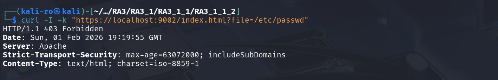
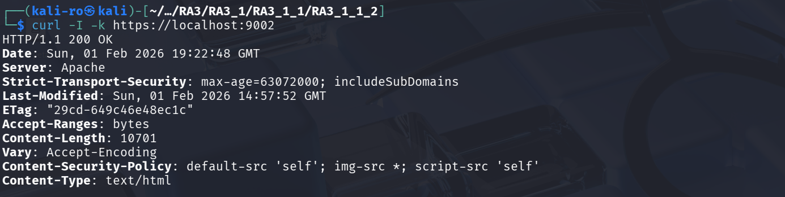

# Práctica 3.1.1.2: Implementación de Web Application Firewall (WAF)

En esta práctica se evoluciona la infraestructura anterior integrando **ModSecurity**, un firewall de aplicaciones web (WAF) de código abierto. El objetivo es supervisar y filtrar el tráfico HTTP para proteger al servidor contra ataques comunes como inyecciones y accesos a archivos sensibles.

## 1. Arquitectura del proyecto

El proyecto se construye sobre la base de la Práctica 1, añadiendo capas de inspección de tráfico:

```text
RA3_1_1_2/
├── config/                    
│   └── modsecurity_custom.conf 
├── Dockerfile
├── .dockerignore
└── README.md                   
```

## 2. Configuración del WAF

### 2.1. Activación del motor (modsecurity_custom.conf)

A diferencia de la configuración recomendada (`DetectionOnly`), en esta práctica se ha forzado el modo de bloqueo activo:

* **SecRuleEngine On:** ModSecurity intercepta y deniega activamente las peticiones sospechosas.
* **Límites de Cuerpo (Anti-DoS):** Se establecen límites estrictos para `SecRequestBodyLimit` (12.5 MB) para prevenir ataques de denegación de servicio por agotamiento de recursos.

### 2.2. Reglas de filtrado personalizadas

Para validar el funcionamiento sin depender aún de las reglas completas de OWASP, se ha implementado una regla manual de detección:

* **ID 1001:** Bloquea cualquier petición que contenga la cadena `/etc/passwd` en los argumentos, devolviendo un error **403 Forbidden**.

## 3. Dockerfile

El despliegue utiliza la imagen de la **Práctica 1** como base, asegurando que el servidor ya cuente con SSL y Hardening previo.

```dockerfile
# Se usa la imagen anterior para heredar las configuraciones
FROM pps10832615/pps:pr3111

# 1. Instalar ModSecurity (WAF)
RUN apt-get update && \
    apt-get install -y libapache2-mod-security2 && \
    apt-get clean && \
    rm -rf /var/lib/apt/lists/*

# 2. Configuración base
# Renombramos la configuración recomendada para que ModSecurity arranque con valores por defecto
RUN cp /etc/modsecurity/modsecurity.conf-recommended /etc/modsecurity/modsecurity.conf

# 3. Inyectar configuración personalizada
# Copiamos el archivo de reglas en la carpeta config
COPY config/modsecurity_custom.conf /etc/apache2/conf-available/modsecurity_custom.conf

# 4. Habilitar módulo y configuración
RUN a2enmod security2 && \
    a2enconf modsecurity_custom

# CMD y EXPOSE se heredan de la imagen base (80, 443)
```

## 4. Guía de despliegue

Para poner en marcha el servidor con WAF activo, ejecuta los siguientes comandos:

### 4.1. Obtención de la imagen

```bash
docker pull pps10832615/pps:pr3112
```

### 4.2. Lanzamiento del servicio con WAF

```bash
docker run -d --name practica2_waf -p 8080:80 -p 9002:443 pps10832615/pps:pr3112
```

## 5. Verificación

### 5.1. Test de path traversal

Simulación de acceso a ficheros del sistema, el resultado debe ser un error **403 Forbidden**:

```bash
curl -I -k "https://localhost:9002/index.html?file=/etc/passwd"
```



### 5.2. Persistencia del hardening

Se comprueba que las cabeceras de la práctica 3_1_1_1_1 (HSTS/CSP) se mantienen gracias a la herencia de imágenes:

```bash
curl -I -k https://localhost:9002
```



# 6. Parada y limpieza

```bash
# Detener el proceso del contenedor
docker stop practica2_waf

# Eliminar el contenedor del sistema
docker rm practica2_waf
```

## 7. Repositorio Docker Hub

La imagen final se encuentra disponible en el siguiente enlace: [pps10832615/pps:pr3112](https://hub.docker.com/repository/docker/pps10832615/pps/tags/pr3112)