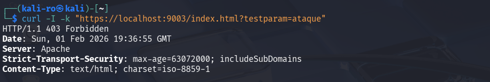
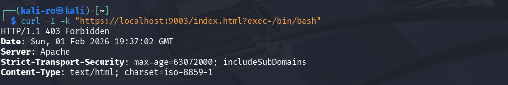
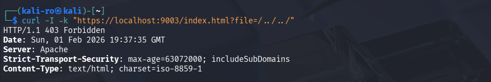

# Práctica 3.1.1.3: Implementación de reglas OWASP CRS y filtros personalizados 

En esta práctica se alcanza el nivel avanzado de protección WAF integrando el conjunto de reglas **OWASP Core Rule Set (CRS)** en ModSecurity. Además, se implementan reglas de detección personalizadas para validar el comportamiento del motor ante patrones de ataque específicos.

## 1. Arquitectura del proyecto

El despliegue hereda la base de las prácticas anteriores e incorpora el repositorio oficial de reglas de SpiderLabs:

```text
RA3_1_1_3/
├── config/                 
│   ├── security2.conf      
│   └── owasp-testing.conf
├── .dockerignore
├── Dockerfile             
└── README.md               
```

## 2. Configuración avanzada del WAF

### 2.1. Integración de OWASP CRS

Se ha automatizado la descarga y despliegue del Core Rule Set:

* **Automatización:** Uso de `git clone` para obtener las reglas más recientes.
* **Setup:** Activación del archivo `crs-setup.conf` para establecer los niveles de paranoia y umbrales de anomalía por defecto.
* **Inclusión:** Configuración del archivo `security2.conf` para cargar recursivamente todas las reglas ubicadas en `/etc/modsecurity/rules/*.conf`.

### 2.2. Reglas de detección propias 

Para verificar el funcionamiento, se ha creado una regla manual en el archivo `security2.conf`:

* **Regla ID 1234:** Analiza el argumento `testparam`. Si contiene la palabra **"ataque"**, el WAF deniega la petición con un **403 Forbidden** y registra el mensaje: *"Alerta de seguridad - Esto es un ataque"*.

## 3. Definición del Dockerfile

Este Dockerfile destaca por realizar una limpieza tras la instalación para mantener la imagen optimizada (eliminando `git` y archivos temporales).

```dockerfile
# 1. Imagen base de la practica anterior
FROM pps10832615/pps:pr3112

# 2. Instalación de las herramientas (git)
RUN apt-get update && \
    apt-get install -y git && \
    apt-get clean && \
    rm -rf /var/lib/apt/lists/*

# 3. Descargar las reglas OWASP
RUN git clone https://github.com/SpiderLabs/owasp-modsecurity-crs.git /tmp/owasp-modsecurity-crs

# 4. Mover archivo de setup
RUN mv /tmp/owasp-modsecurity-crs/crs-setup.conf.example /etc/modsecurity/crs-setup.conf

# 5. Mover las reglas
RUN mkdir -p /etc/modsecurity/rules && \
    cp -r /tmp/owasp-modsecurity-crs/rules/* /etc/modsecurity/rules/

# 6. Aplicar nuestra configuración
COPY config/security2.conf /etc/apache2/mods-available/security2.conf

# 7. Activar unique_id
RUN a2enmod unique_id

# 8. Limpieza para que pese menos la imagen
RUN rm -rf /tmp/owasp-modsecurity-crs && \
    apt-get purge -y git && \
    apt-get autoremove -y

# CMD y Expose se heredan
```

## 4. Guía de despliegue 

Ejecuta los siguientes comandos para desplegar el servidor con el conjunto completo de reglas:

### 4.1. Obtención de la imagen

```bash
docker pull pps10832615/pps:pr3113
```

### 4.2. Lanzamiento del servicio

```bash
docker run -d --name practica3_owasp -p 8080:80 -p 9003:443 pps10832615/pps:pr3113
```

## 5. Verificación

### 5.1. Test de regla personalizada

Validación del bloqueo mediante el parámetro definido en `security2.conf`:

```bash
curl -I -k "https://localhost:9003/index.html?testparam=ataque"
```



### 5.2. Test de ataque complejo (Command Injection)

Prueba de detección del CRS de OWASP bloqueando intentos de ejecución de comandos:

```bash
curl -I -k "https://localhost:9003/index.html?exec=/bin/bash"
```

 

### 5.3. Test de path traversal avanzado

```bash
curl -I -k "https://localhost:9003/index.html?file=/../../"
```



# 6. Parada y limpieza

```bash
# Detener el proceso del contenedor
docker stop practica3_owasp

# Eliminar el contenedor del sistema
docker rm practica3_owasp
```

## 7. Docker Hub

La imagen final se encuentra disponible en: [pps10832615/pps:pr3113](https://hub.docker.com/repository/docker/pps10832615/pps/tags/pr3113)