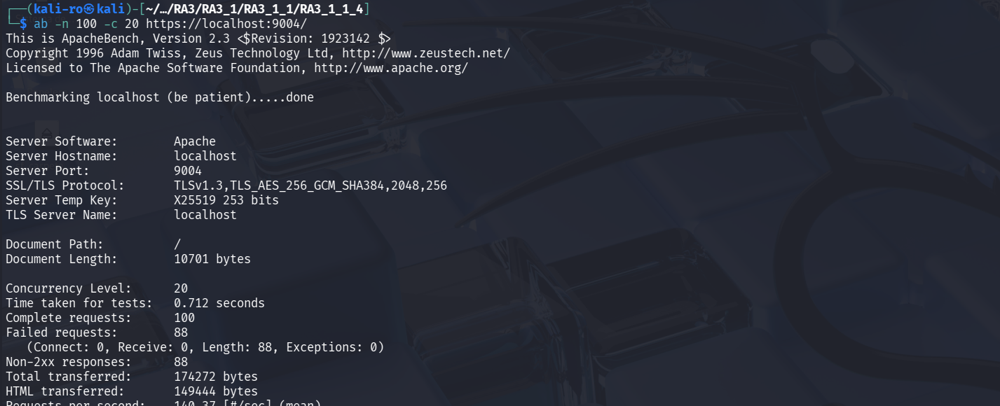
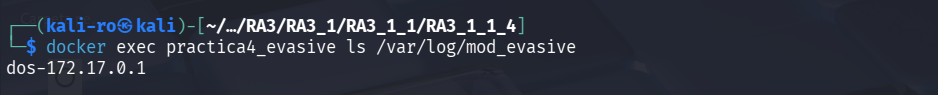

# Práctica 3.1.1.4: Mitigación de Ataques DoS con mod_evasive

En esta práctica se refuerza la seguridad del servidor mediante la implementación de **mod_evasive**. Este módulo de Apache actúa como una capa de defensa proactiva contra ataques de denegación de servicio (DoS, DDoS) y ataques de fuerza bruta, detectando y bloqueando temporalmente IPs que superan umbrales de tráfico sospechosos.

## 1. Arquitectura del proyecto

El despliegue hereda la configuración avanzada de las tres prácticas anteriores (SSL, Hardening y WAF OWASP), añadiendo el control de inundación:

```text
RA3_1_1_4/
├── config/                 
│   └── evasive.conf        
├── assets/       
├── .dockerignore 
├── Dockerfile              
└── README.md               
```

## 2. Configuración de mod_evasive

Se ha personalizado el archivo `evasive.conf` para establecer una política de detección equilibrada:

* **DOSPageCount 5:** Límite de peticiones a la misma página por intervalo.
* **DOSSiteCount 100:** Límite de peticiones totales al sitio (objetos, imágenes, etc.).
* **DOSPageInterval 1s / DOSSiteInterval 2s:** Intervalos de tiempo para el conteo de peticiones.
* **DOSBlockingPeriod 10:** Tiempo en segundos que la IP atacante permanecerá en la "lista negra" recibiendo un error **403 Forbidden**.
* **DOSLogDir:** Directorio persistente para el registro de bloqueos, configurado con permisos para el usuario `www-data`.

## 3. Definición del Dockerfile

El Dockerfile utiliza la imagen de la **Práctica 3** como base, integrando el módulo y herramientas de benchmarking.

```dockerfile
# 1. Usamos la imagen de la práctica anterior
FROM pps10832615/pps:pr3113

# 2. Instalación de herramientas
RUN apt-get update && \
    apt-get install -y libapache2-mod-evasive apache2-utils && \
    apt-get clean && \
    rm -rf /var/lib/apt/lists/*

# 3. Preparacion del directorio de logs
RUN mkdir -p /var/log/mod_evasive && \
    chown -R www-data:www-data /var/log/mod_evasive

# 4. Aplicamos nuestra configuración
COPY config/evasive.conf /etc/apache2/mods-available/evasive.conf

# 5. Habilitar el módulo
RUN a2enmod evasive

# CMD y EXPOSE se heredan (80, 443)
```

## 4. Guía de despliegue

Siga estos comandos para poner en marcha el servidor protegido contra inundación:

### 4.1. Obtención de la imagen

```bash
docker pull pps10832615/pps:pr3114
```

### 4.2. Lanzamiento del servicio

```bash
docker run -d --name practica4_evasive -p 8080:80 -p 9004:443 pps10832615/pps:pr3114
```

## 5. Verificación (Test de estrés con Apache Bench)

Para comprobar que el módulo detecta el ataque y bloquea la IP, utilizaremos la herramienta `ab` (Apache Bench) enviando un conjunto de peticiones que supere los límites configurados.

### 5.1. Ejecución del ataque simulado

```bash
# Enviamos 100 peticiones en ráfagas de 20
ab -n 100 -c 20 https://localhost:9004/
```



### 5.2. Análisis del informe de Apache Bench

En el reporte generado por `ab`, se debe observar que una parte de las peticiones han fallado (Non-2xx responses).

* **Qué sucede?:** Al superar las 5 peticiones por segundo, `mod_evasive` comienza a responder con **403 Forbidden** a la IP de origen.


### 5.3. Comprobación de Logs de bloqueo

Se verifica que el sistema ha creado un registro para la IP bloqueada en el directorio configurado:

```bash
docker exec practica4_evasive ls /var/log/mod_evasive
```



## 6. Parada y limpieza

```bash
# Detener el proceso del contenedor
docker stop practica4_evasive

# Eliminar el contenedor del sistema
docker rm practica4_evasive
```

## 7. Docker Hub

La imagen final se encuentra disponible en: [pps10832615/pps:pr3114](https://hub.docker.com/repository/docker/pps10832615/pps/tags/pr3114)