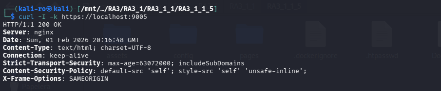
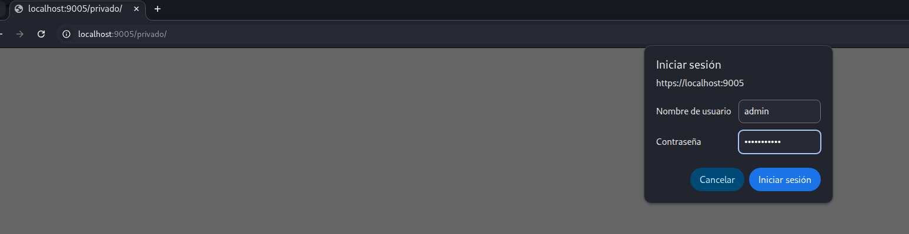
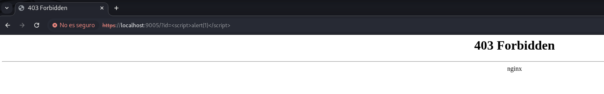

# Práctica 3.1.1.5: Hardening de Nginx, PHP-FPM y ModSecurity v3

Esta práctica final integra todos los conceptos de seguridad avanzada en un entorno basado en **Nginx**. Se implementa el procesamiento de scripts **PHP** mediante un gestor de procesos independiente (**PHP-FPM**) y se protege la infraestructura con **ModSecurity v3** utilizando el conjunto de reglas **OWASP CRS**.

## 1. Arquitectura del proyecto

El despliegue se organiza para separar la lógica del servidor web, la configuración de seguridad del WAF:

```text
RA3_1_1_5/
├── config/                
│   ├── default.conf        
│   ├── modsec_includes.conf
│   ├── modsecurity.conf    
│   └── www.conf           
├── pages/                  
│   ├── index.html         
│   ├── index.php           
│   └── privado/           
├── .dockerignore  
├── Dockerfile             
└── README.md
```

## 2. Implementación de seguridad

### 2.1. Hardening de Nginx (default.conf)

* **Canal Seguro:** Implementación de SSL/TLS en el puerto 443 con certificados generados dinámicamente.
* **Cabeceras Estrictas:** Configuración de `Strict-Transport-Security` (HSTS) para forzar HTTPS y `Content-Security-Policy` (CSP) para mitigar XSS.
* **Minimización de Información:** Desactivación de `server_tokens` para ocultar la versión de Nginx.
* **Zona Privada:** Acceso restringido al directorio `/privado` mediante autenticación básica HTTP (`.htpasswd`).

### 2.2. Web Application Firewall (ModSecurity v3)

* **Motor Activo:** Configuración de `SecRuleEngine On` para el bloqueo preventivo de amenazas.
* **Integración CRS:** Carga jerárquica de reglas OWASP a través de `modsec_includes.conf`, protegiendo contra inyecciones SQL, XSS y ataques de sistema.

### 2.3. Entorno PHP Seguro (PHP-FPM)

* **Mínimo Privilegio:** El proceso PHP-FPM se ejecuta bajo el usuario `nginx` y se comunica mediante un socket TCP en el puerto 9000.

## 3. Definición del Dockerfile

El despliegue automatiza la instalación de PHP, la generación de credenciales y la orquestación de servicios:

```dockerfile
# Usamos una imagen de Nginx que ya incluya ModSecurity v3
FROM owasp/modsecurity-crs:nginx
USER root

# 1. Instalar PHP y utilidades
RUN apt-get update && \
    apt-get install -y php-fpm openssl apache2-utils && \
    apt-get clean && \
    rm -rf /var/lib/apt/lists/*

# 2. Cargar el módulo modsecurity
RUN sed -i '1i load_module modules/ngx_http_modsecurity_module.so;' /etc/nginx/nginx.conf

# 3. Fix para las reglas OWASP
RUN if [ -f /etc/modsecurity.d/owasp-crs/crs-setup.conf.example ]; then \
        mv /etc/modsecurity.d/owasp-crs/crs-setup.conf.example /etc/modsecurity.d/owasp-crs/crs-setup.conf; \
    fi

# 4. Directorios de logs php
RUN mkdir -p /run/php && \
    touch /var/log/php-fpm.log && \
    chown -R nginx:nginx /var/log/php-fpm.log /run/php

# 5. Configuración certificados SSL
RUN mkdir -p /etc/nginx/ssl && \
    openssl req -x509 -nodes -days 365 -newkey rsa:2048 \
    -keyout /etc/nginx/ssl/nginx.key \
    -out /etc/nginx/ssl/nginx.crt \
    -subj "/C=ES/ST=Castellon/L=Castellon/O=IES/CN=localhost"

# 6. Auth
RUN htpasswd -bc /etc/nginx/.htpasswd admin Taller.2014

# 7. Copiar las configuraciones
# Copiamos la configuración de PHP pool
COPY config/www.conf /etc/php/8.2/fpm/pool.d/www.conf
# Copiamos configuraciones de Nginx
COPY config/default.conf /etc/nginx/conf.d/default.conf
COPY config/modsec_includes.conf /etc/nginx/modsec_includes.conf
COPY config/modsecurity.conf /etc/modsecurity.d/modsecurity.conf
# Copiamos la web
COPY pages/ /var/www/html/

# 8. Permisos
RUN chown -R nginx:nginx /var/www/html

EXPOSE 80 443

# 9. Arranque directo
CMD /usr/sbin/php-fpm8.2 -F & nginx -g "daemon off;"

```

## 4. Guía de despliegue

### 4.1. Obtención de la imagen

```bash
docker pull pps10832615/pps:pr3115
```

### 4.2. Lanzamiento del servicio

```bash
docker run -d --name practica5_nginx -p 8080:80 -p 9005:443 pps10832615/pps:pr3115
```

## 5. Verificación y auditoría

Para comprobar la correcta implementación de las capas de seguridad en este entorno Nginx, se deben seguir los siguientes pasos de auditoría:

### 5.1. Verificación de hardening y certificado SSL

Este test confirma que el canal es seguro y que el servidor no revela información sensible en sus cabeceras.

* **Desde Terminal:** Ejecute `curl -I -k https://localhost:9005`.
* **Resultado esperado:** El servidor debe mostrar `server_tokens off` (ocultando la versión de Nginx) y las cabeceras `Strict-Transport-Security` y `Content-Security-Policy` activas.



### 5.2. Test de integración PHP-FPM

Comprobación del procesamiento dinámico y el aislamiento de procesos.

* **Acción:** Navegue a `https://localhost:9005/index.php`.
* **Resultado esperado:** Debe visualizarse la página de configuración de PHP (phpinfo). Esto garantiza que Nginx está comunicándose correctamente con el socket de PHP-FPM en el puerto 9000.


### 5.3. Control de Acceso a zona privada

Validación de la autenticación básica configurada en el servidor.

* **Acción:** Intente acceder a `https://localhost:9005/privado/`.
* **Resultado esperado:** El navegador debe interrumpirte y mostrar un cuadro solicitando credenciales. El acceso solo se permite tras introducir las credenciales configuradas en el archivo `.htpasswd`. En este caso la credencial es `admin:Taller.2014`.



### 5.4. Pruebas de bloqueo del WAF (ModSecurity v3 + CRS)

Se realizan ataques simulados mediante la interfaz gráfica para verificar la respuesta proactiva del firewall:

| Tipo de Ataque | Inyección en URL (Navegador) | Resultado Esperado |
| --- | --- | --- |
| **XSS** | `https://localhost:9005/?id=<script>alert(1)</script>` | **403 Forbidden** |
| **SQL Injection** | `https://localhost:9005/?user='OR'1'='1` | **403 Forbidden** |
| **Path Traversal** | `https://localhost:9005/?file=/etc/passwd` | **403 Forbidden** |



## 6. Parada y limpieza

```bash
# Detener el proceso del contenedor
docker stop practica5_nginx

# Eliminar el contenedor del sistema
docker rm practica5_nginx
```

## 7. Docker Hub

Imagen disponible en: [pps10832615/pps:pr3115](https://hub.docker.com/repository/docker/pps10832615/pps/tags/pr3115)