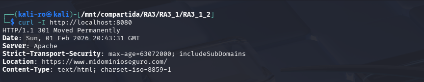
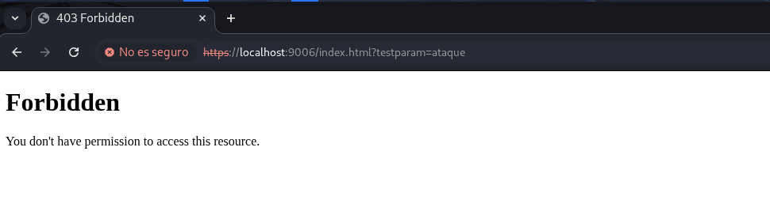

# Práctica 3.1.2: Redirección forzosa y certificados SSL personalizados

Esta práctica se centra en garantizar la integridad y confidencialidad de las comunicaciones. Se configura un entorno donde el tráfico en texto plano es inexistente mediante una **redirección permanente (301)** y se establece una identidad corporativa mediante certificados SSL personalizados.

## 1. Arquitectura del proyecto

El despliegue introduce la configuración de red segura sobre la base de seguridad robusta construida en las prácticas anteriores:

```text
RA3_1_2/
├── config/
│   └── default-ssl.conf
├── assets/
├── .dockerignore
├── Dockerfile
└── README.md
```

## 2. Dockerfile

Se utiliza la herencia para mantener activos el WAF (ModSecurity) y el módulo Anti-DoS mientras se implementa la capa SSL.

```dockerfile
# Usamos la imagen anterior para poder heredar la seguridad ya configurada
FROM pps10832615/pps:pr3114

# Instalamos openssl
RUN apt-get update && \
    apt-get install -y openssl && \
    apt-get clean && \
    rm -rf /var/lib/apt/lists/*

# Activar el módulo SSL
RUN a2enmod ssl

# Crear directorio para certificados
RUN mkdir -p /etc/apache2/ssl

# Generar la clave y certificado
# Inyectamos los datos de Castellón directamente
RUN openssl req -x509 -nodes -days 365 -newkey rsa:2048 \
    -keyout /etc/apache2/ssl/apache.key \
    -out /etc/apache2/ssl/apache.crt \
    -subj "/C=ES/ST=Castellon/L=Castellon de la Plana/O=IES El Caminas/OU=Departament of Server Development/CN=www.midominioseguro.com"

# Copiar la configuración mejorada (con redirección)
COPY config/default-ssl.conf /etc/apache2/sites-available/default-ssl.conf

# Activar el host virtual SSL y desactivar el default antiguo
RUN a2dissite 000-default.conf && a2ensite default-ssl.conf

# Puertos
EXPOSE 80 443

# El CMD se hereda, no hace falta ponerlo
```

## 3. Guía de despliegue

Ejecuta estos comandos para poner en marcha el servidor con la nueva capa de seguridad:

### 3.1. Obtención de la imagen

```bash
docker pull pps10832615/pps:pr312
```

### 3.2. Lanzamiento del servicio

```bash
docker run -d --name practica6_ssl -p 8080:80 -p 9006:443 pps10832615/pps:pr312
```

### 3.3. Resolución de nombres

Para que el servidor reconozca las peticiones dirigidas al dominio configurado, es imprescindible mapear la IP local en la máquina anfitriona antes de iniciar las pruebas.

* Edite el archivo de hosts: `sudo nano /etc/hosts`
* Añada la línea: `127.0.0.1 www.midominioseguro.com`

## 4. Protocolo de verificación (Interfaz y terminal)

Sigue estos pasos para comprobar que el endurecimiento del servidor es total:

### 4.1. Verificación de redirección

Para comprobar que es imposible acceder por el puerto 80 sin ser redirigido:

* **Comando:** `curl -I http://localhost:8080`
* **Resultado:** Debe devolver un estado **301** indicando la nueva ubicación en `https`.



### 4.2. Validación de identidad del certificado

Para validar que el certificado SSL contiene los datos de la organización configurados:

* **Acción:** Acceda a `https://localhost:9006`, haga clic en el candado del navegador y consulte "Ver certificado".
* **Resultado:** Debe aparecer **O = IES El Caminas** y **L = Castellon de la Plana**.


### 4.3. Test de persistencia de seguridad

Para demostrar que el WAF sigue protegiendo el nuevo sitio SSL:

* **Acción:** Navegue a `https://localhost:9006/index.html?testparam=ataque`.
* **Resultado:** El servidor debe responder con un **403 Forbidden** (Regla personalizada heredada).



## 5. Parada y limpieza del entorno

Una vez finalizadas las comprobaciones, utiliza estos comandos para limpiar el sistema:

```bash
# Detener el contenedor
docker stop practica6_ssl

# Eliminar el contenedor
docker rm practica6_ssl
```

## 6. Docker Hub

La imagen final se encuentra disponible en: [pps10832615/pps:pr312](https://hub.docker.com/repository/docker/pps10832615/pps/tags/pr312)