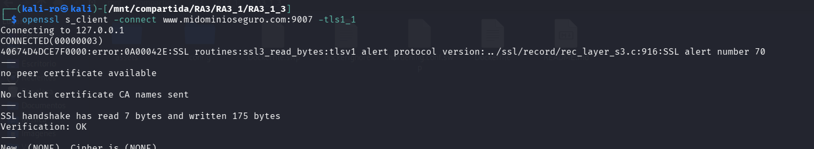
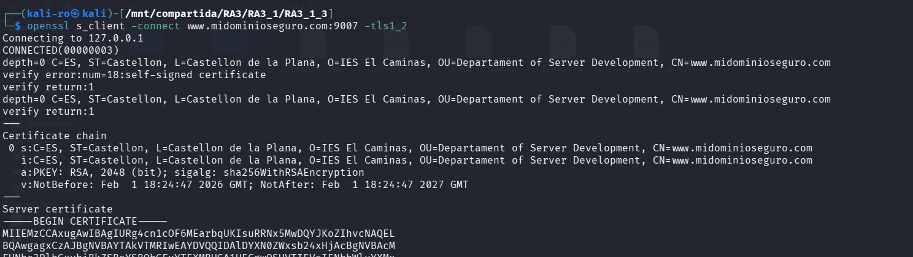
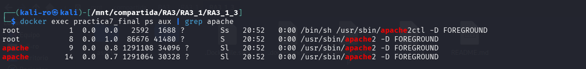
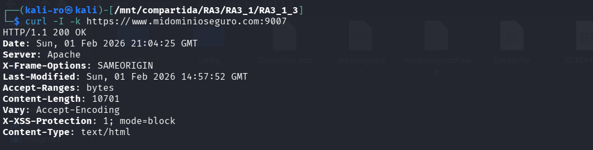
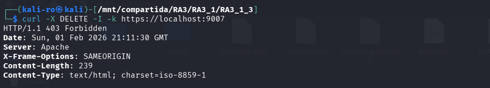

# Práctica 3.1.3: Endurecimiento Integral y Hardening de Protocolos

El objetivo de esta práctica es cerrar cualquier vector de ataque residual mediante la configuración de un entorno de "privilegio mínimo" y la restricción de protocolos obsoletos, asegurando que el servidor solo acepte conexiones de alta seguridad.

## 1. Arquitectura del proyecto

El despliegue final organiza las directivas de seguridad en archivos especializados para facilitar su auditoría:

```text
RA3_1_3/
├── config/                 
│   ├── final-ssl.conf      
│   └── hardening.conf      
├── assets/                 
├── Dockerfile       
├── .dockerignore
└── README.md              
```

## 2. Configuración de seguridad avanzada 

### 2.1. Hardening SSL de alto nivel (final-ssl.conf)

Se ha configurado el host virtual para eliminar vulnerabilidades de protocolos antiguos:

* **SSLProtocol -ALL +TLSv1.2:** Se deshabilitan protocolos inseguros (SSLv2, SSLv3, TLS 1.0, 1.1) permitiendo únicamente TLS 1.2 o superior.
* **SSLCipherSuite HIGH:!MEDIUM:!aNULL:!MD5:!RC4:** Se fuerza el uso de algoritmos de cifrado de alta resistencia, prohibiendo explícitamente MD5 y RC4.

### 2.2. Restricciones globales (hardening.conf)

* **Privilegio mínimo:** El servidor se configura para denegar el acceso a todo el sistema raíz (`<Directory />`) por defecto.
* **Control de métodos:** Se bloquean todos los métodos HTTP excepto `GET`, `POST` y `HEAD` para prevenir ataques de manipulación de archivos.
* **Ofuscación:** Se implementa `SecServerSignature` para cambiar el banner del servidor a uno personalizado ("Servidor_Seguro_PPS").
* **Seguridad de sesión:** Se editan las cabeceras de las cookies para forzar los atributos `HttpOnly` y `Secure` automáticamente.
* **Filtrado de protocolo:** Se utiliza `mod_rewrite` para denegar cualquier petición que no sea estrictamente HTTP/1.1.

## 3. Definición del Dockerfile

Este archivo realiza cambios estructurales en la ejecución de Apache para mejorar la seguridad del sistema operativo anfitrión.

```dockerfile
# Usamos la imagen con todas las configuraciones acumuladas
FROM pps10832615/pps:pr312

# 1. Habilitar módulos necesarios
RUN a2enmod headers rewrite

# 2. Deshabilitar modulos innecesarios
RUN a2dismod dav dav_fs info autoindex -f || true

# 3. Creación de un usuario y un grupo llamado apache
RUN groupadd apache && \
    useradd -g apache -d /var/www/html -s /sbin/nologin apache

# 4. Configuración Apache para usar este usuario en vez de www-data
RUN sed -i 's/export APACHE_RUN_USER=www-data/export APACHE_RUN_USER=apache/g' /etc/apache2/envvars && \
    sed -i 's/export APACHE_RUN_GROUP=www-data/export APACHE_RUN_GROUP=apache/g' /etc/apache2/envvars

# 5. Permisos de directorios /conf y /bin
RUN chmod -R 750 /etc/apache2 && \
    chown -R apache:apache /var/log/apache2 /var/run/apache2 /var/lock/apache2 /var/www/html

# 6. Aplicar nuestra configuración
COPY config/hardening.conf /etc/apache2/conf-available/hardening.conf
RUN a2enconf hardening

# 7. Aplicar hardening ssl sobreescribiendo el anterior
COPY config/final-ssl.conf /etc/apache2/sites-available/default-ssl.conf

# 8. Limpieza de cabeceras
RUN echo "ServerTokens Prod" >> /etc/apache2/apache2.conf && \
    echo "ServerSignature Off" >> /etc/apache2/apache2.conf

EXPOSE 80 443
```

## 4. Guía de despliegue

Siga estos pasos para desplegar la versión más segura del servidor Apache:

### 4.1. Obtención de la imagen

```bash
docker pull pps10832615/pps:pr313

```

### 4.2. Lanzamiento del servicio

```bash
docker run -d --name practica7_final -p 8080:80 -p 9007:443 pps10832615/pps:pr313

```

### 4.3. Resolución de nombres

Para que el servidor reconozca las peticiones dirigidas al dominio configurado, es imprescindible mapear la IP local en la máquina anfitriona antes de iniciar las pruebas.

* Edite el archivo de hosts: `sudo nano /etc/hosts`
* Añada la línea: `127.0.0.1 www.midominioseguro.com`

---

## 5. Verificación y auditoría

Realice las siguientes pruebas para certificar el endurecimiento integral del sistema:

### 5.1. Auditoría de protocolos y cifrados (TLS Hardening) 

Se verifica que el servidor cumple estrictamente con la prohibición de protocolos obsoletos configurada en el archivo `final-ssl.conf`.

**Prueba de Protocolo Inseguro (TLS 1.1):**
* **Comando:** `openssl s_client -connect localhost:9007 -tls1_1`
* **Resultado:** El servidor devuelve un error `protocol version (alert number 70)`.



**Prueba de Protocolo Seguro (TLS 1.2):**
* **Comando:** `openssl s_client -connect localhost:9007 -tls1_2`
* **Resultado:** Conexión exitosa utilizando el cifrado `ECDHE-RSA-AES256-GCM-SHA384`.




### 5.2. Verificación de usuario y banner (Aislamiento y ofuscación) 

Comprobación del entorno de "privilegio mínimo" y la reducción de la superficie de reconocimiento.

* **Comando (Usuario):** `docker exec practica7_final ps aux | grep apache`
* **Comando (Banner):** `curl -I -k https://localhost:9007`






### 5.3. Test de métodos prohibidos

Validación de la restricción de verbos HTTP para prevenir manipulaciones no autorizadas.

* **Comando:** `curl -X DELETE -I -k https://localhost:9007`
* **Resultado esperado:** **403 Forbidden**.



---

## 6. Parada y limpieza del entorno 

```bash
# Detener el contenedor
docker stop practica7_final

# Eliminar el contenedor
docker rm practica7_final

```

## 7. Docker Hub

Imagen final consolidada: [pps10832615/pps:pr313](https://www.google.com/search?q=https://hub.docker.com/repository/docker/pps10832615/pps/tags/pr313)