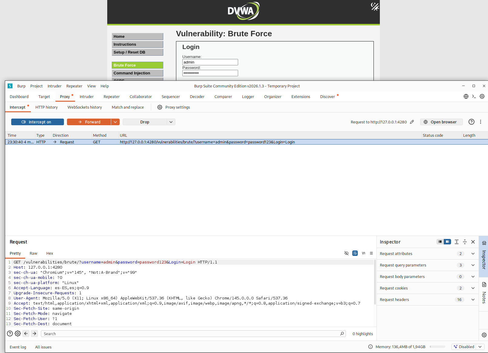
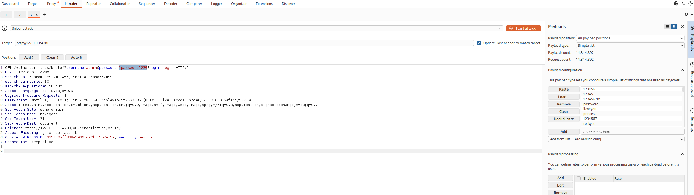
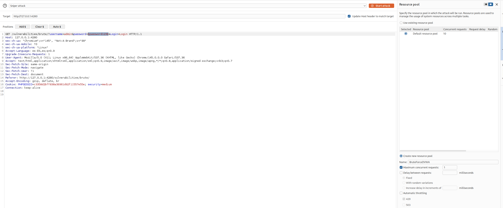
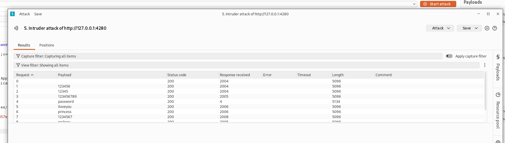

# 1. Brute Force - DVWA

El objetivo principal de esta práctica es realizar un ataque de fuerza bruta sobre un formulario de inicio de sesión HTTP para obtener credenciales válidas.

## Análisis de la vulnerabilidad (Niveles LOW y MEDIUM)

Al enviar un nombre de usuario y contraseña en la aplicación, se observa que los datos viajan expuestos a través de una petición de tipo **GET** en la URL. 

Mientras que en el nivel **Low** no existe ninguna restricción para lanzar ataques masivos, en el nivel **Medium** el servidor implementa un mecanismo de defensa: **la respuesta se retrasa intencionadamente entre 2 y 3 segundos** tras cada intento incorrecto. Esto busca mitigar los ataques automatizados.

---

## Metodología de explotación (Nivel MEDIUM)

Para realizar el ataque evadiendo el mecanismo de retardo y sin saturar el servidor, se ha utilizado el módulo **Intruder** de **Burp Suite** en lugar de herramientas de terminal como Hydra.

### Paso 1: Interceptación de la petición

Primero, se captura la petición `GET` de login viendo que la cookie de seguridad refleja el nivel actual (`security=medium`). Esta petición contiene los parámetros `username` y `password` listos para ser manipulados. 

*Captura 1: Interceptación de la petición GET inicial en la pestaña Proxy mostrando las credenciales de prueba.*

### Paso 2: Configuración del Payload (Sniper)

Se envía la petición interceptada al Intruder. En la pestaña *Positions*, se define el tipo de ataque como **Sniper** y se marca únicamente el valor del parámetro de la contraseña (`§password123§`) como punto de inyección. Posteriormente, en la pestaña *Payloads*, se carga un diccionario de contraseñas comunes (ej. el principio de `rockyou.txt`). 

*Captura 2: Configuración del payload tipo Sniper sobre la variable de la contraseña.*

### Paso 3: Evasión de la defensa de retardo (Resource Pool)

Para lidiar con el retraso de 2-3 segundos y evitar que Burp Suite pierda peticiones o sature la cola, es crucial configurar el flujo de envío. En la pestaña *Resource Pool*, se crea una nueva regla configurando las **peticiones concurrentes máximas a 1** (Maximum concurrent requests: 1). De este modo, la herramienta envía una contraseña, espera pacientemente la respuesta, y luego envía la siguiente. 

*Captura 3: Creación de un Resource Pool limitado a 1 petición concurrente para evitar bloqueos.*

### Paso 4: Análisis de Resultados y éxito

Una vez finalizado el ataque, se analizan las respuestas en la tabla de resultados. Los intentos fallidos devuelven un código de estado HTTP 200 con una longitud de respuesta (*Length*) de aprox. 5096 bytes. Sin embargo, al observar la petición correspondiente al payload `password`, se detecta un cambio en la longitud (5134 bytes). Este diferencial confirma que el servidor ha devuelto una página distinta (la página de bienvenida de sesión iniciada). 

*Captura 4: Resultados del ataque donde se destaca el cambio en la longitud (Length) para la contraseña correcta.*

### Resultado final
* **Usuario:** `admin`
* **Contraseña:** `password`