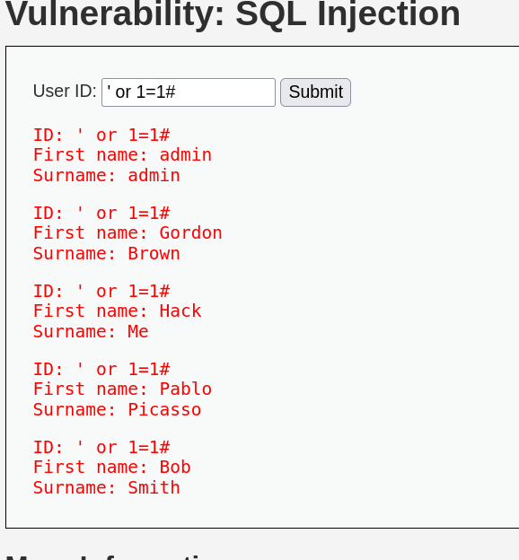
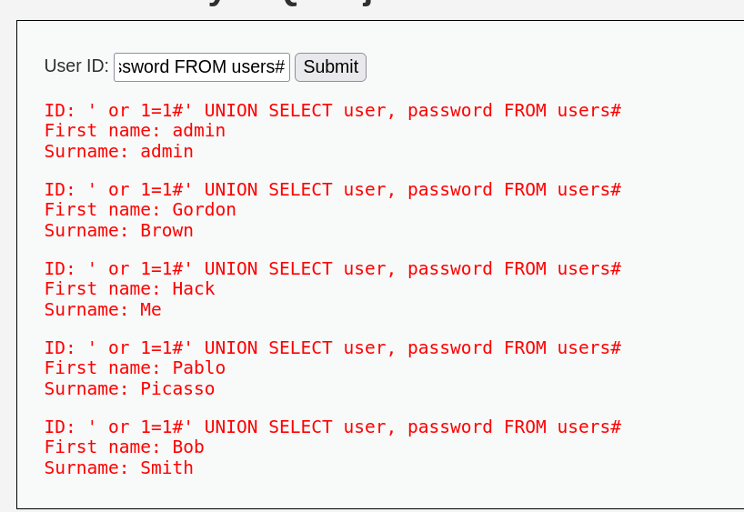
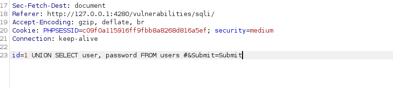
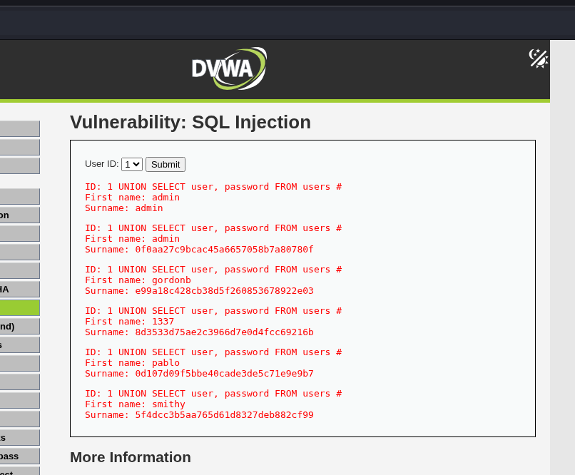

# 10. SQL Injection - DVWA

El objetivo de esta práctica es explotar una vulnerabilidad de Inyección SQL para manipular las consultas que el servidor realiza a la base de datos, logrando extraer información confidencial a la que no deberíamos tener acceso.

## 1. Nivel LOW

### Análisis y explotación

En el nivel de seguridad bajo, la aplicación recibe un ID de usuario a través de un campo de texto y lo envía por el método *GET* sin sanear las comillas simples (`'`). Al introducir una comilla, rompemos la sintaxis de la consulta SQL del backend.

Sabiendo que el campo es inyectable, primero verificamos la vulnerabilidad introduciendo una condición lógica que siempre sea verdadera (`' or 1=1#`). El símbolo `#` comenta el resto de la consulta original para evitar errores de sintaxis.

*Captura 1: Uso de una condición booleana siempre verdadera (' or 1=1#) para engañar a la consulta y volcar todos los registros de la tabla visible.*

Una vez confirmada la inyección, el siguiente paso es extraer información de otras tablas. Utilizando el operador `UNION`, podemos concatenar el resultado de la consulta original con una consulta propia. Sabiendo que la tabla objetivo es `users`, inyectamos nuestra sentencia.

* **Payload utilizado:** `' UNION SELECT user, password FROM users#`

*Captura 2: Extracción de credenciales usando el operador UNION. La aplicación muestra los nombres de usuario y sus contraseñas en texto claro reflejados en la interfaz.*

---

## 2. Nivel MEDIUM

### Análisis de la vulnerabilidad y evasión (Bypass)
En el nivel medio, el desarrollador ha implementado dos medidas defensivas: 
1. La petición ahora se envía por el método **POST** mediante un menú desplegable (limitando la interacción directa en la interfaz web).
2. Se utiliza una función para eliminar las comillas (`'`), impidiendo el salto de la consulta de texto clásica.

Sin embargo, el parámetro `id` tratado en el backend es de tipo numérico, por lo que se inserta directamente en la consulta SQL sin comillas protectoras en el código original. Al no necesitar romper comillas de apertura, nuestra inyección es mucho más directa.

### Metodología de explotación
Para evadir la restricción del menú desplegable de la interfaz web, interceptamos la petición POST utilizando **Burp Suite**. En el cuerpo de la petición, localizamos el parámetro `id` y le concatenamos nuestra inyección `UNION`, pero esta vez sin usar comillas.

* **Payload utilizado:** `1 UNION SELECT user, password FROM users #`

*Captura 3: Interceptación en Burp Suite. Se inyecta la consulta SQL directamente en el parámetro "id" del cuerpo de la petición HTTP, aprovechando la ausencia de comillas en la variable numérica.*

Al reenviar la petición modificada al servidor, la inyección se procesa con éxito. La base de datos ejecuta el `UNION` y el servidor nos devuelve la tabla de usuarios con sus respectivos hashes de contraseñas.

*Captura 4: Ejecución exitosa de la inyección SQL ciega a comillas en el nivel Medium. La pantalla vuelca los hashes reales de todos los usuarios registrados en el sistema.*