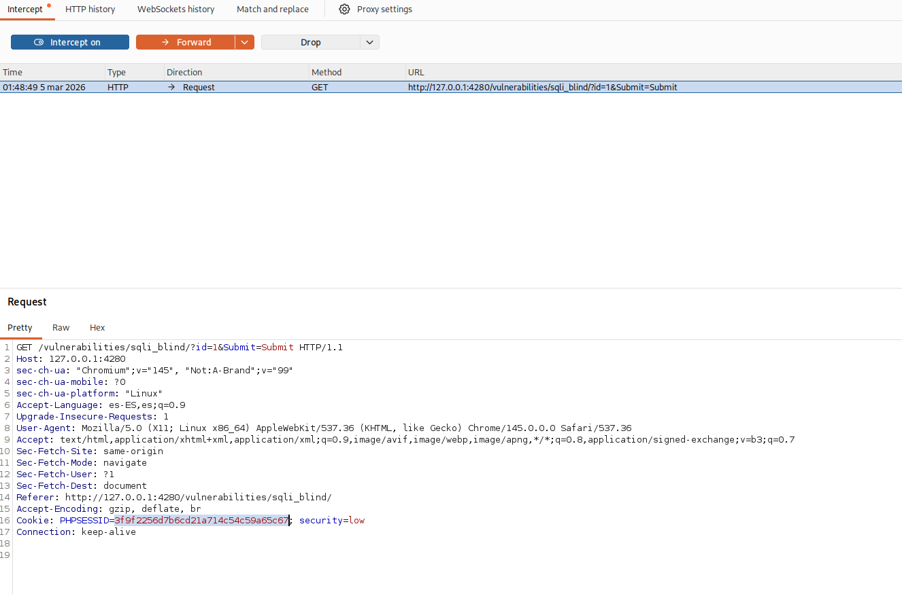
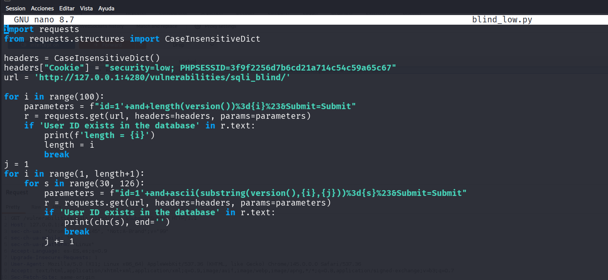
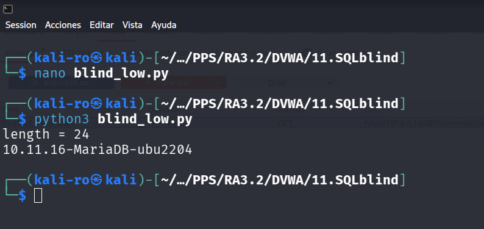
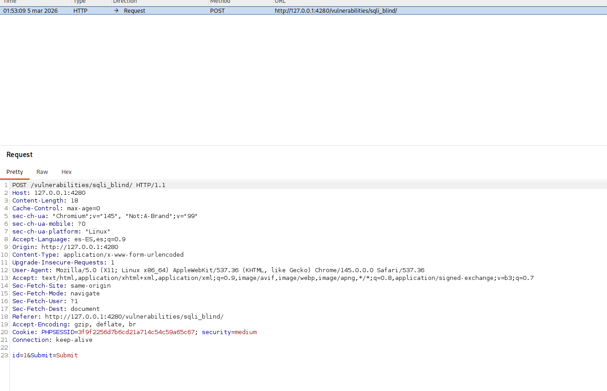
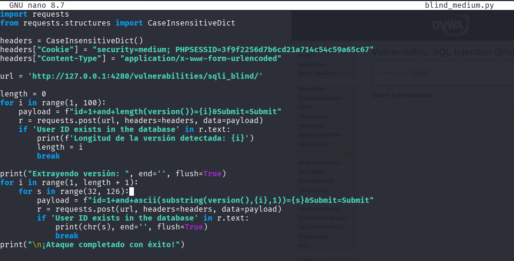
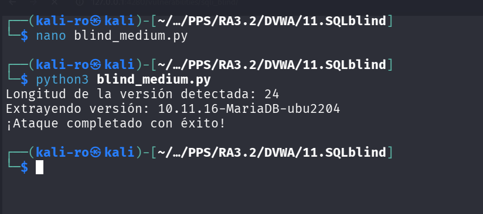

# 11. SQL Injection (Blind) - DVWA

El objetivo de esta práctica es explotar una vulnerabilidad de Inyección SQL Ciega. A diferencia de una inyección SQL normal, en una inyección "ciega" la aplicación web no refleja los datos de la base de datos en la pantalla ni muestra errores de sintaxis. 

El atacante debe investigar la información haciendo preguntas de "Verdadero o Falso" a la base de datos (Boolean-Based) o inyectando retardos de tiempo (Time-Based) y evaluando la respuesta del servidor. Para que este proceso no sea eterno, se requiere automatización mediante *scripts*.

## 1. Nivel LOW

### Análisis y explotación

En el nivel bajo, la vulnerabilidad se encuentra en el parámetro GET `id`. Para confirmar que el punto es inyectable, se envía el payload `1' and sleep(5)#`. Si el servidor tarda 5 segundos exactos en responder, confirmamos que la base de datos está procesando nuestras instrucciones.

*Captura 1: Interceptación de la petición GET inicial con Burp Suite para identificar las cabeceras y cookies de sesión necesarias para el script.*

Dado que la aplicación solo responde "User ID exists in the database" (Verdadero) o "User ID is MISSING" (Falso), desarrollamos un script en Python para extraer la versión exacta de la base de datos letra por letra.

*Captura 2: Script en Python configurado para automatizar la extracción de datos mediante fuerza bruta basada en respuestas booleanas.*

El script funciona en dos fases: primero realiza peticiones incrementales para adivinar la longitud de la cadena de la versión (`length(version())=i`). Una vez conocida la longitud, utiliza las funciones `substring()` y `ascii()` para iterar sobre cada carácter del código ASCII hasta que la página devuelva la respuesta afirmativa.

*Captura 3: Ejecución exitosa del ataque. El script determina que la longitud es de 24 caracteres y extrae correctamente la versión de la base de datos (10.11.16-MariaDB-ubu2204).*

---

## 2. Nivel MEDIUM

### Análisis de la vulnerabilidad y evasión

En el nivel medio, la aplicación pasa a utilizar el método **POST** para enviar los datos e implementa la eliminación de comillas simples (`'`). Sin embargo, al igual que en la inyección SQL clásica, el parámetro numérico `id` se concatena directamente en la consulta, haciendo innecesario el uso de comillas.

### Metodología de explotación

El concepto del ataque es idéntico, pero adaptamos el enfoque a nivel de red. Interceptamos la nueva petición POST para estructurar nuestro ataque.

*Captura 4: Interceptación del tráfico donde se observa el paso de GET a POST y el envío de variables en el cuerpo de la petición.*

Ajustamos nuestro script de Python para que envíe solicitudes `requests.post()`, declarando el `Content-Type: application/x-www-form-urlencoded` y pasando nuestros payloads sin utilizar comillas.

*Captura 5: Adaptación del script de Python para el nivel Medium, inyectando directamente en la variable numérica del payload POST.*

Al ejecutar el script, la iteración a ciegas vuelve a funcionar esquivando las protecciones de este nivel.

*Captura 6: El ataque por POST finaliza con éxito, exfiltrando nuevamente la versión completa de la base de datos carácter por carácter.*