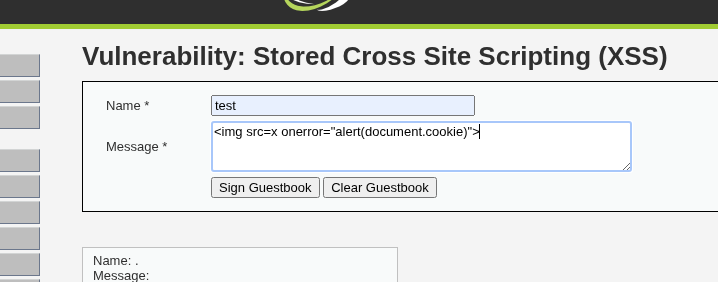
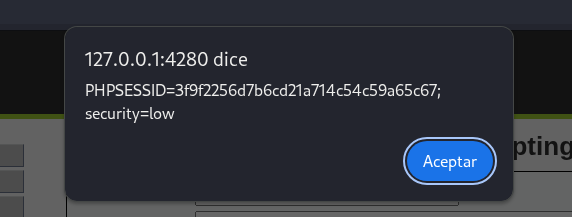
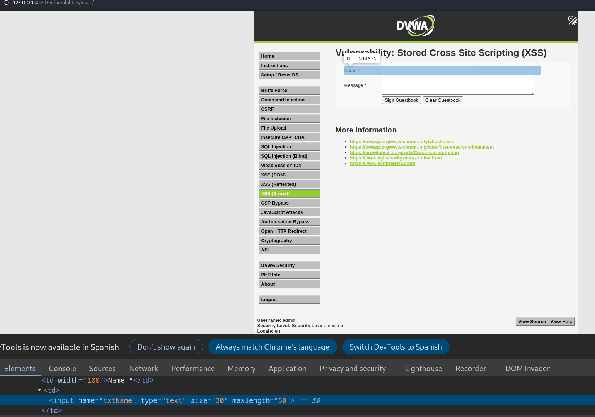
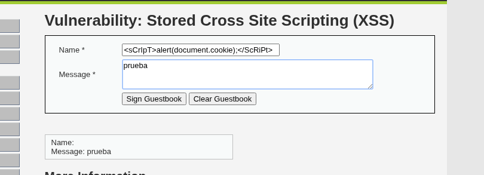
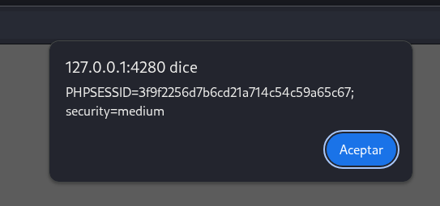

# 12. Stored Cross Site Scripting (XSS) - DVWA

El objetivo de esta práctica es explotar una vulnerabilidad de Cross-Site Scripting Almacenado (Stored XSS). A diferencia del XSS Reflejado, aquí el código malicioso inyectado se guarda de forma permanente en la base de datos de la aplicación web. Cuando un usuario legítimo entra a leer los mensajes, su navegador descarga y ejecuta automáticamente el payload.

## 1. Nivel LOW

### Análisis y explotación

En el nivel de seguridad bajo, la aplicación web no realiza ninguna sanitización en los campos del formulario. Podemos inyectar código HTML y JavaScript directamente en el campo de texto ancho (`Message`).

Para evitar usar la clásica etiqueta ``

*Captura 4: Inyección del payload ofuscado en el campo Name, aprovechando la modificación previa del DOM.*

Al enviar el formulario, el servidor acepta el texto y lo almacena. El navegador vuelve a cargar el libro de visitas y ejecuta nuestra etiqueta de script modificada, confirmando que la evasión ha funcionado.

*Captura 5: El ataque se completa con éxito, evadiendo el filtro de etiquetas y demostrando la ejecución del JavaScript reflejado en la cookie "security=medium".*