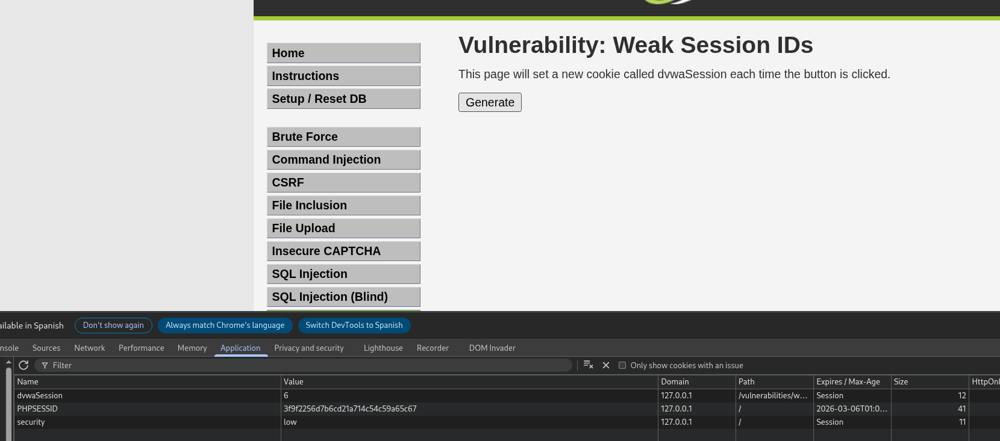
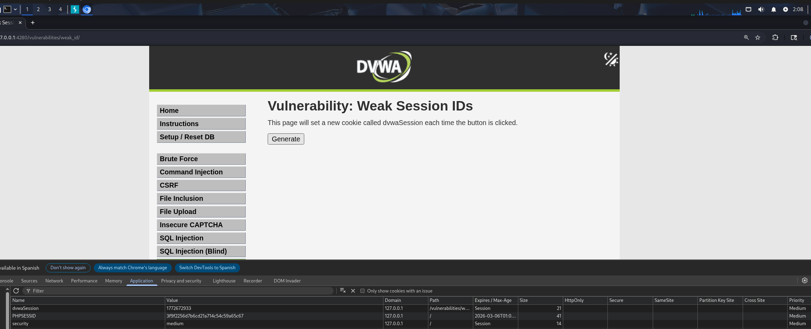
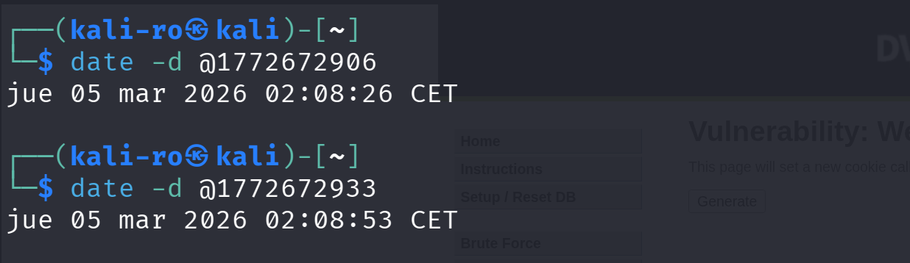

# 13. Weak Session IDs - DVWA

El objetivo de esta práctica es demostrar la vulnerabilidad resultante cuando una aplicación web genera identificadores de sesión o *cookies* utilizando patrones predecibles en lugar de valores aleatorios y complejos. Si un atacante puede predecir el ID de sesión del próximo usuario, podrá suplantar su identidad.

## 1. Nivel LOW

### Análisis y explotación

En el nivel de seguridad bajo, la aplicación genera una cookie llamada `dvwaSession` cada vez que hacemos clic en el botón. Al inspeccionar el valor asignado utilizando las Herramientas de Desarrollador del navegador (pestaña *Application*), observamos un patrón evidente.

El valor inicial de la cookie es un número bajo que simplemente se incrementa en `1` con cada nueva petición.

*Captura 1: Herramientas de desarrollador mostrando la cookie dvwaSession. Su valor (6) evidencia un contador secuencial trivialmente predecible.*

Sabiendo esto, un atacante solo necesita generar una sesión para ver en qué número va el contador (ej. 6) e inyectar en su propio navegador la cookie con el valor siguiente (7) para tener la sesión de la persona que se autentique justo después.

---

## 2. Nivel MEDIUM

### Análisis de la vulnerabilidad y comprobación

En el nivel medio, el desarrollador ha intentado complicar la generación del ID para que no sea un simple contador de un solo dígito. Al generar una nueva sesión, el valor que nos devuelve el servidor es un número muy largo (ej. `1772672933`).

*Captura 2: Generación de la cookie dvwaSession en nivel medio. El valor ha dejado de ser un dígito único para convertirse en una cadena numérica larga.*

Aunque pueda parecer un número aleatorio, su formato de 10 dígitos es un claro indicador de que la aplicación está utilizando la función `time()` de PHP, lo que se conoce como **UNIX Timestamp** (los segundos transcurridos desde el 1 de enero de 1970).

Para demostrar que la generación de esta cookie sigue siendo predecible y vulnerable, copiamos un par de valores obtenidos en diferentes momentos y utilizamos el comando `date` en nuestra terminal de Linux para traducirlos. 

*Captura 3: Comprobación del vector de ataque. La terminal convierte los valores de la cookie en fechas exactas, confirmando que el ID de sesión se basa exclusivamente en la hora del servidor.*

Al depender únicamente de la hora exacta de inicio de sesión, un atacante que conozca el momento en el que la víctima interactuó con el servidor puede calcular el Timestamp correspondiente y forzar el acceso, demostrando que esta implementación sigue siendo una mala práctica de seguridad.