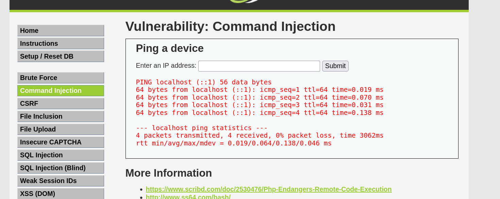
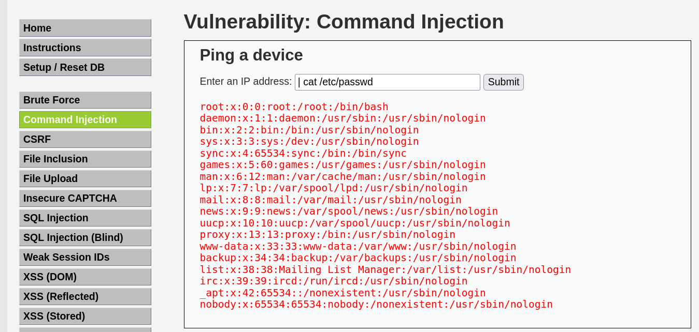

# 2. Command Injection - DVWA

El objetivo principal de esta práctica es identificar y explotar una vulnerabilidad de inyección de comandos en el sistema operativo (OS Command Injection) a través de un formulario de una aplicación web.

## Análisis de la vulnerabilidad

Al analizar el comportamiento de la funcionalidad realizar un ping, se deduce que el backend está tomando la entrada del usuario y concatenándola directamente en una consola del sistema subyacente (por ejemplo, ejecutando `ping <entrada_usuario>`). 

Al no existir una sanitización adecuada de los datos de entrada, es posible utilizar operadores de control de la terminal de Linux (como el operador *pipe* `|`, `&&`, o `;`) para evadir el comando original y obligar al servidor a ejecutar comandos arbitrarios.

---

## Metodología de explotación

### Paso 1: Verificación del comportamiento normal

En primer lugar, se introduce una dirección válida como `localhost` para entender cómo interactúa el servidor. La página web devuelve el resultado estándar que normalmente se vería en la consola al ejecutar el comando `ping localhost`.

*Captura 1: Respuesta legítima del servidor al ejecutar un ping contra localhost.*

### Paso 2: Inyección del payload

Sabiendo que la consola del sistema está procesando nuestra entrada, se procede a inyectar un comando utilizando el carácter de tubería (`|`). Este operador le dice al sistema que ejecute el comando que viene a continuación. 

Se utiliza el payload: `| cat /etc/passwd`. 
El servidor procesa la instrucción y, en lugar de mostrar el resultado del ping, nos devuelve la ejecución de nuestro comando, exponiendo a través de la interfaz web la lista de usuarios del sistema.

*Captura 2: Explotación de la vulnerabilidad concatenando comandos para visualizar el contenido de /etc/passwd.*

### Resultado final
El uso del operador `|` resulta efectivo para evadir los filtros básicos de la aplicación, demostrando que es posible tomar el control del sistema operativo y extraer información sensible directamente desde la web.