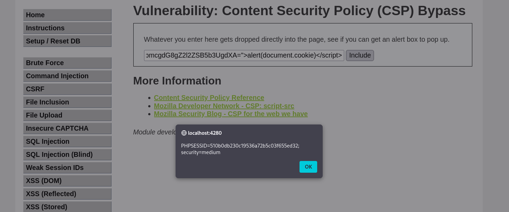

# 3. Content Security Policy (CSP) Bypass - DVWA

El objetivo de esta práctica es evadir la Política de Seguridad de Contenido (CSP) implementada por el servidor para lograr ejecutar código JavaScript arbitrario (Cross-Site Scripting).

## Análisis de la vulnerabilidad y explotación (Nivel MEDIUM)

Una política CSP sirve para indicar al navegador qué fuentes de contenido (como scripts, imágenes o estilos) son de confianza. En el nivel **Medium**, la seguridad se basa en la directiva `nonce` (Number Used Once). El navegador solo ejecutará scripts en línea (`<script>...</script>`) que contengan un atributo `nonce` que coincida con el valor generado y autorizado por el servidor.

### Identificación del fallo
Un nonce seguro debe ser un valor aleatorio y único en cada petición HTTP. Sin embargo, al revisar el comportamiento de la página, se descubre que el desarrollador ha introducido el valor de forma estática (hardcodeada), repitiéndose en cada carga: 
`nonce="TmV2ZXIgZ29pbmcgdG8gZ2l2ZSB5b3UgdXA="`

### Ejecución del ataque
Sabiendo que el servidor validará como legítimo cualquier script que lleve ese atributo exacto, podemos construir nuestro propio payload malicioso incluyéndolo para engañar al navegador. 

**Payload utilizado:**
```html
<script nonce="TmV2ZXIgZ29pbmcgdG8gZ2l2ZSB5b3UgdXA=">alert(document.cookie)</script>
```

### Evidencia de éxito

Al introducir el payload modificado en el formulario, la directiva CSP es evadida con éxito. El navegador procesa la inyección como código autorizado y ejecuta el JavaScript, mostrando un cuadro de alerta con las cookies de sesión del usuario.


*Captura 1: Explotación exitosa en el nivel Medium. El navegador ejecuta la alerta mostrando las cookies de sesión (PHPSESSID) tras aceptar el nonce estático.*
