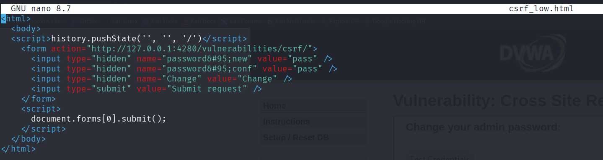
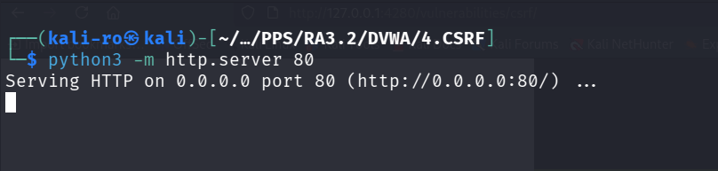
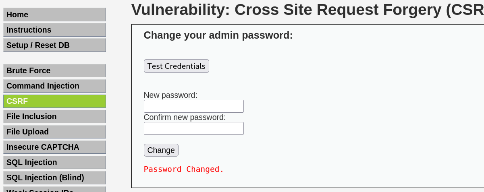
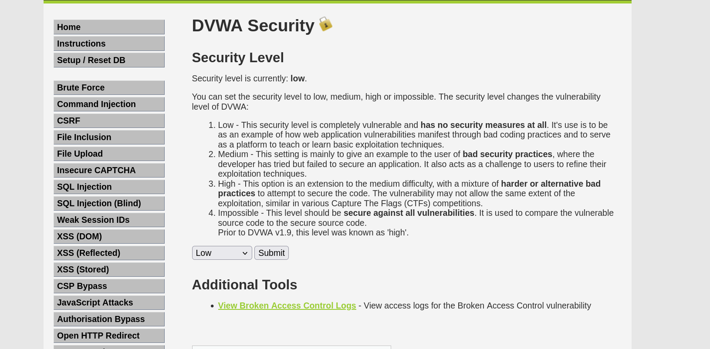
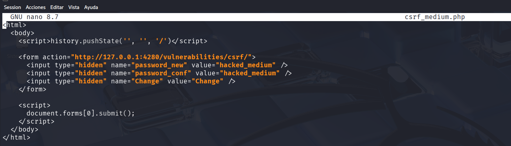
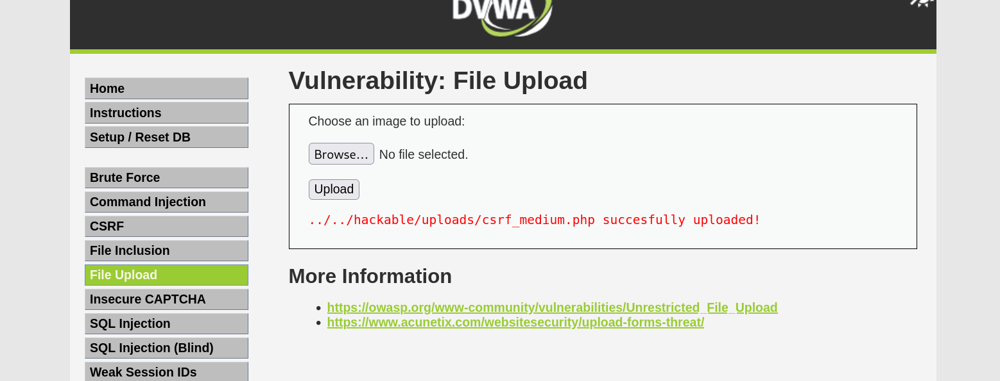
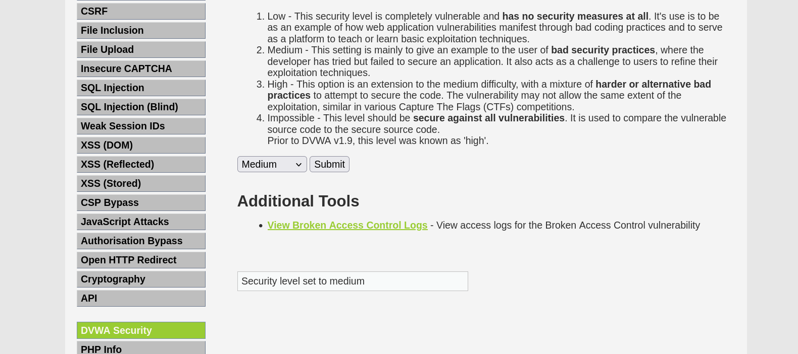
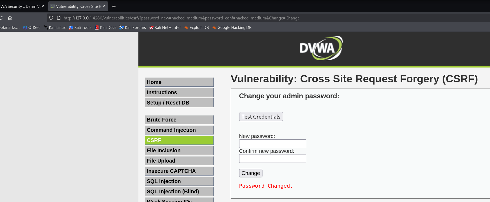

# 4. Cross Site Request Forgery (CSRF) - DVWA

El objetivo de esta práctica es explotar una vulnerabilidad CSRF para forzar a un usuario autenticado a ejecutar acciones no deseadas en la aplicación web, en este caso, cambiar su propia contraseña sin su consentimiento.

## 1. Nivel LOW

### Análisis de la vulnerabilidad
En el nivel bajo, el formulario de cambio de contraseña utiliza una petición `GET` y no implementa ningún tipo de validación o token. Esto significa que si un usuario autenticado hace clic en un enlace manipulado, su navegador enviará la petición automáticamente, adjuntando sus cookies de sesión, y el servidor la aceptará como válida.

### Metodología de explotación
Para explotar esto, creamos una página web maliciosa controlada por el atacante que contiene un formulario oculto. Este formulario apunta al endpoint de cambio de contraseña de DVWA y utiliza JavaScript para autocompletarse y enviarse (`document.forms[0].submit();`) en el momento en que la víctima abre el enlace.

*Captura 1: Código fuente de `csrf_low.html` diseñado para forzar el cambio de contraseña a "pass".*

Una vez creado el payload, levantamos un servidor web local utilizando Python para simular el alojamiento de la página maliciosa del atacante.

*Captura 2: Ejecución del servidor HTTP con Python para servir el archivo malicioso a la víctima.*

Si la víctima (que tiene la sesión de DVWA abierta en su navegador) visita nuestra IP, el script se ejecuta de forma transparente. El resultado es que su contraseña se cambia inmediatamente sin que tenga que interactuar con la página de DVWA.

*Captura 3: Mensaje de confirmación en DVWA indicando que la contraseña ha sido modificada con éxito.*

---

## 2. Nivel MEDIUM

### Análisis de la vulnerabilidad y el bypass
En el nivel medio, el servidor implementa una medida de seguridad adicional: verifica la cabecera `Referer` de la petición HTTP. Esto significa que la petición de cambio de contraseña solo será aceptada si proviene del mismo servidor. Nuestro ataque anterior desde un servidor externo fallará.

Para evadir esta restricción, combinaremos esta vulnerabilidad con una inyección de archivos (File Upload). Si logramos subir nuestro script malicioso al propio servidor de DVWA, cuando se ejecute, el `Referer` será válido.

### Metodología de explotación

**Paso 1: Preparación del entorno**
Dado que el módulo de subida de archivos (*File Upload*) puede tener sus propias restricciones en nivel medio, reducimos la seguridad de DVWA a nivel **Low** para poder subir nuestro archivo sin impedimentos.

*Captura 4: Configuración temporal de seguridad a nivel bajo para facilitar la carga del payload.*

**Paso 2: Creación y subida del Payload**
Renombramos nuestro script de ataque a `csrf_medium.php` y lo preparamos para que cambie la contraseña al valor `hacked_medium`. 

*Captura 5: Script manipulado listo para ser inyectado en el servidor víctima.*

A continuación, utilizamos el módulo *File Upload* de DVWA para subir el archivo. El servidor nos confirma la ruta donde se ha alojado (`../../hackable/uploads/csrf_medium.php`).

*Captura 6: El servidor vulnerable confirma la subida exitosa de nuestro script malicioso.*

**Paso 3: Ejecución del ataque**
Volvemos a subir el nivel de seguridad a **Medium** para demostrar el bypass. 

*Captura 7: Restauración del nivel de seguridad a Medium previo a la explotación.*

Finalmente, simulamos que la víctima accede al archivo que hemos alojado dentro de su propio servidor (`http://127.0.0.1:4280/hackable/uploads/csrf_medium.php`). Como el script se ejecuta desde el mismo origen que la aplicación, la comprobación del `Referer` es válida y la contraseña se cambia con éxito.

*Captura 8: El ataque se completa. La URL muestra la inyección de los parámetros y la web confirma el cambio de contraseña.*

### Resultado final
Se ha demostrado que la validación del `Referer` es una medida insuficiente contra ataques CSRF si el servidor presenta vulnerabilidades paralelas (como *File Upload* o *XSS*) que permitan inyectar código dentro del mismo dominio de confianza.