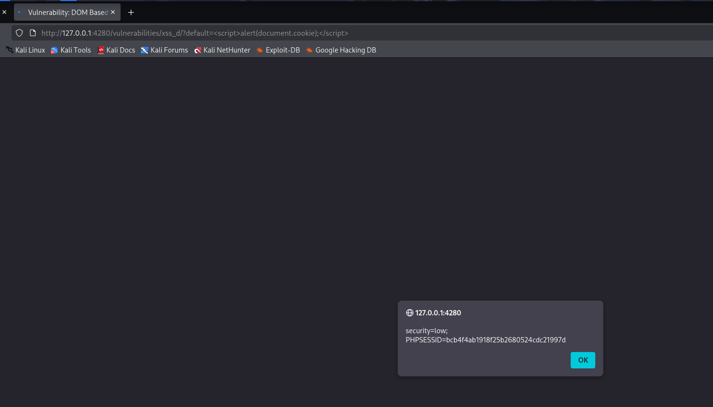
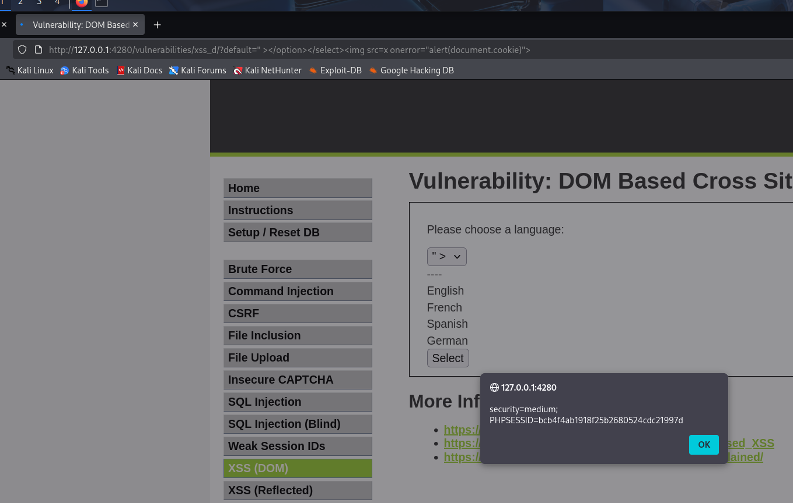
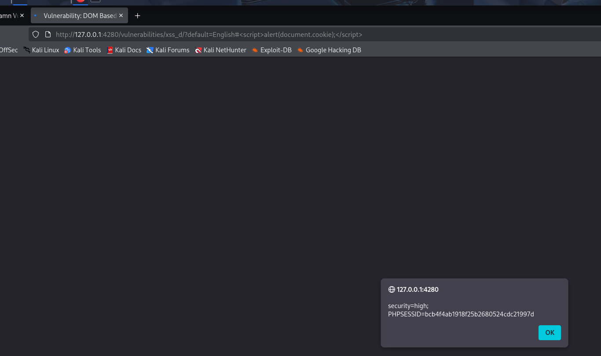

# 5. DOM Based Cross Site Scripting (XSS) - DVWA

El objetivo de esta práctica es explotar una vulnerabilidad de Cross-Site Scripting basada en el DOM (Document Object Model). A diferencia del XSS reflejado o almacenado, en el DOM XSS el payload malicioso no es necesariamente procesado por el servidor web, sino que es ejecutado directamente por el código JavaScript del lado del cliente en el navegador de la víctima.

## 1. Nivel LOW

### Análisis y explotación

En el nivel bajo, la página permite seleccionar un idioma mediante un menú desplegable. Al hacerlo, la selección se refleja en la URL a través del parámetro GET `default` (ej. `default=English`). 

Al no existir ninguna validación o sanitización del lado del cliente antes de procesar este parámetro en el DOM, podemos inyectar etiquetas HTML y JavaScript directamente en la URL.

* **Payload utilizado:** `default=`

*Captura 1: Explotación exitosa en nivel bajo. El navegador procesa la etiqueta script y lanza una alerta mostrando la cookie de sesión de la víctima.*

---

## 2. Nivel MEDIUM

### Análisis de la vulnerabilidad

En este nivel, el servidor implementa un filtro básico que bloquea el uso de la etiqueta ``

*Captura 3: Explotación en nivel alto. El payload se oculta tras el símbolo "#", siendo invisible para los filtros del servidor web pero ejecutable por el motor DOM del navegador.*