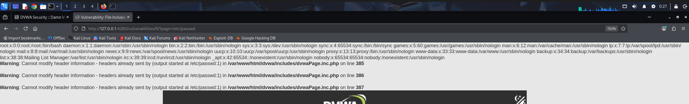
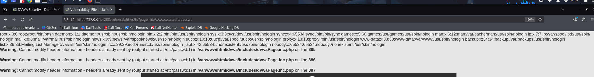

# 6. File Inclusion - DVWA

El objetivo de esta práctica es explotar una vulnerabilidad de Inclusión de Archivos (File Inclusion). Este fallo se produce cuando una aplicación web permite al usuario controlar de forma dinámica qué archivo se incluye y se lee desde el servidor.

## 1. Niveles LOW y MEDIUM

### Análisis y explotación

Al navegar por la aplicación, observamos que la URL utiliza un parámetro GET llamado `page` para cargar el contenido de la web (por ejemplo, `?page=include.php`). 

Dado que el servidor no sanea ni valida correctamente la entrada de este parámetro en los niveles bajo y medio, podemos sustituir el nombre del archivo original por la ruta de un archivo crítico del propio servidor.

* **Payload utilizado:** `?page=/etc/passwd`

*Captura 1: Explotación exitosa de LFI. Al inyectar la ruta absoluta en el parámetro page, la aplicación web vuelca y expone el contenido del archivo de usuarios del sistema Linux.*

---

## 2. Nivel HIGH

### Análisis de la vulnerabilidad y evasión (Bypass)

En el nivel de seguridad alto, el desarrollador ha implementado una validación específica: el servidor comprueba que el valor introducido en el parámetro comience obligatoriamente por la palabra `file`. Si intentamos usar nuestro payload anterior directamente, la petición será rechazada.

Para evadir esta restricción, combinamos la inclusión de archivos con una técnica de **Path Traversal** (Salto de directorios). Comenzamos nuestro payload con la palabra exigida (`file`) para pasar el filtro y, a continuación, utilizamos la secuencia `../` repetidas veces para retroceder desde el directorio actual hasta la raíz del sistema de archivos (`/`). Desde ahí, podemos apuntar nuevamente al archivo objetivo.

* **Payload utilizado:** `?page=file/../../../../../../etc/passwd`

*Captura 2: Bypass de la restricción en nivel alto. Se engaña al filtro iniciando la cadena con la palabra permitida y se utilizan los saltos de directorio para alcanzar el archivo /etc/passwd.*