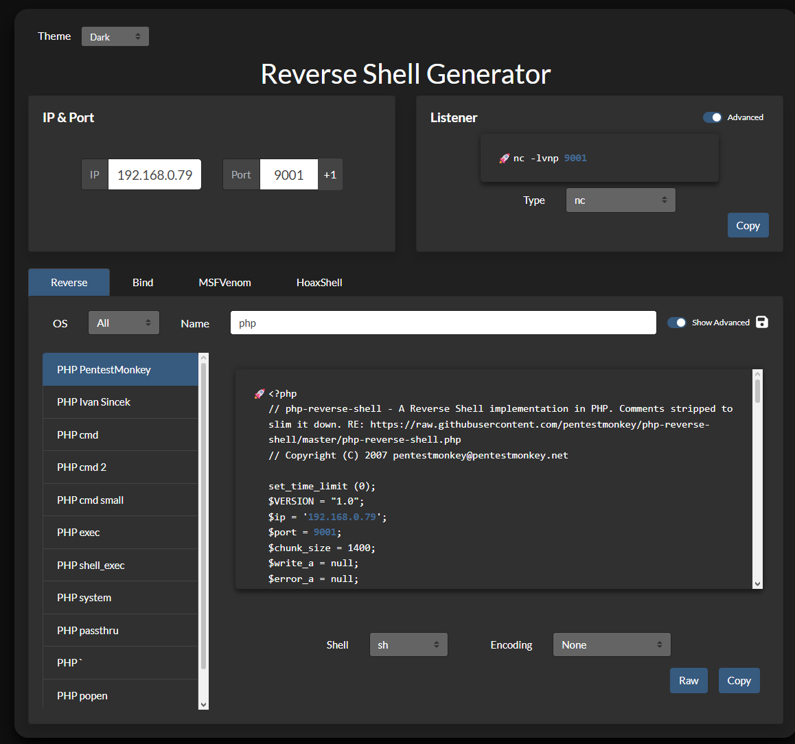
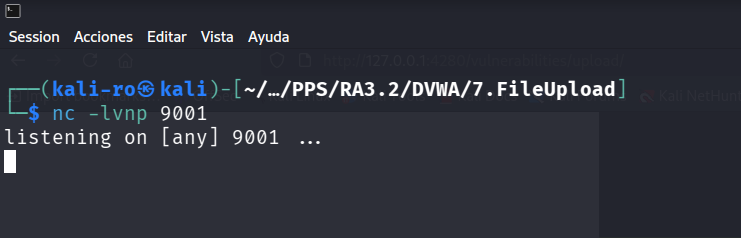
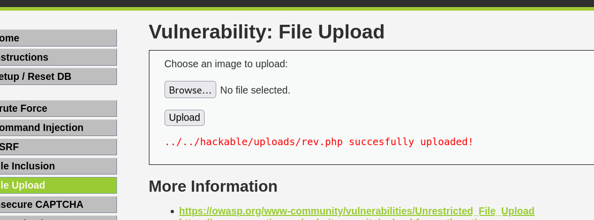
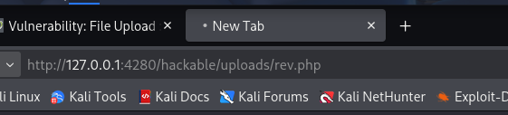
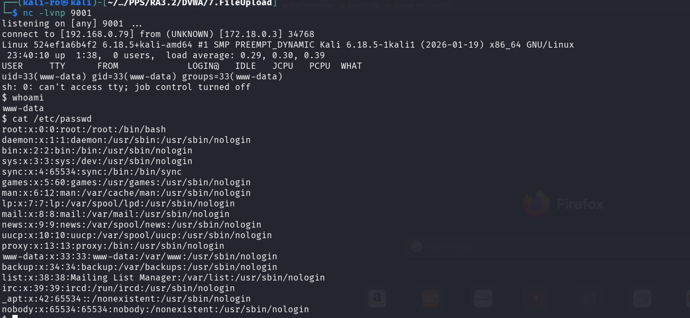
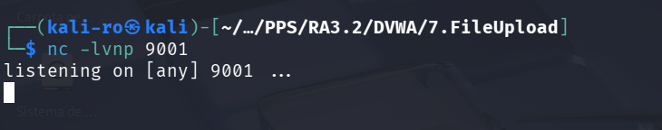
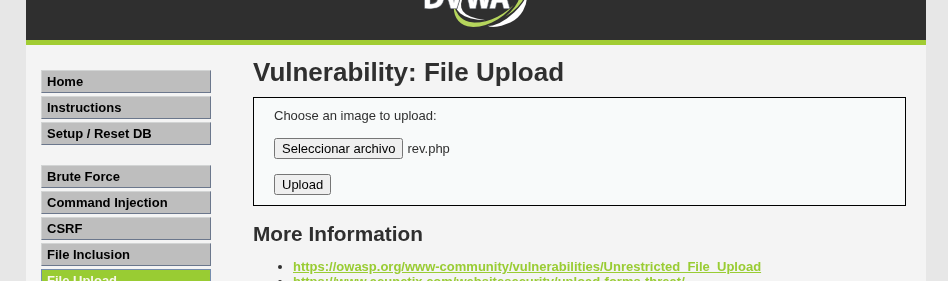
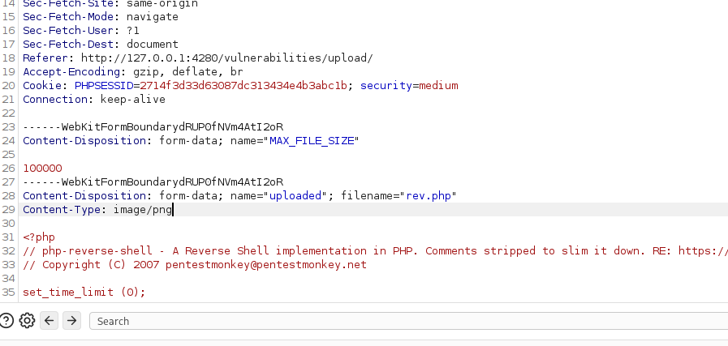
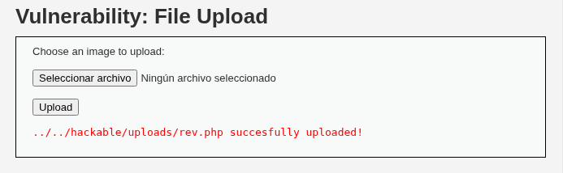
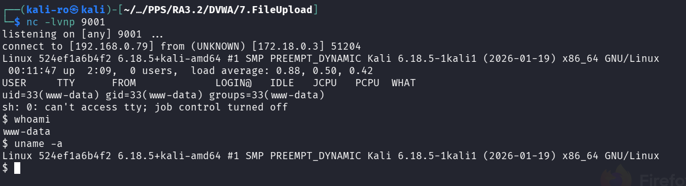

# 7. File Upload - DVWA

El objetivo de esta práctica es explotar una vulnerabilidad de subida de archivos (File Upload) para lograr ejecutar código arbitrario en el servidor, obteniendo finalmente una conexión remota (Reverse Shell).

## 1. Nivel LOW

### Análisis de la vulnerabilidad

En el nivel bajo, el servidor no realiza ningún tipo de validación sobre los archivos que el usuario sube. No se comprueba la extensión ni el contenido. Esto nos permite subir directamente un script en PHP ejecutable.

### Metodología de explotación

**Paso 1: Creación del Payload**
Utilizamos la herramienta online *RevShells* para generar un script de Reverse Shell en PHP. Configuramos nuestra IP de atacante y el puerto en el que vamos a escuchar (9001) y descargamos el archivo como `rev.php`.

*Captura 1:Configuración del payload malicioso apuntando a la máquina del atacante.*

**Paso 2: Preparación del Listener**
Antes de subir el archivo, abrimos una terminal en nuestra máquina Kali y ponemos a Netcat en modo escucha en el puerto especificado para interceptar la conexión entrante.

*Captura 2: Ejecución del comando `nc -lvnp 9001`.*

**Paso 3: Subida del archivo**
A través del formulario vulnerable de DVWA, seleccionamos nuestro archivo `rev.php` y lo subimos. La aplicación web nos devuelve la ruta exacta donde se ha guardado el archivo.

*Captura 3: El servidor confirma la subida y expone la ruta del directorio (`../../hackable/uploads/rev.php`).*

**Paso 4: Ejecución y obtención de la Shell**
Para ejecutar el código de nuestro archivo, simplemente navegamos hacia esa ruta utilizando el navegador web. 

*Captura 4: Ejecución del archivo PHP mediante una petición GET.*

Al cargar la página, el script PHP se ejecuta en el servidor y nos devuelve una conexión a nuestra terminal. Ahora tenemos ejecución de comandos remota (RCE) con los privilegios del usuario `www-data`.

*Captura 5: Conexión establecida exitosamente.*

---

## 2. Nivel MEDIUM

### Análisis de la vulnerabilidad y evasión

En el nivel medio, el desarrollador ha implementado una protección básica: el servidor verifica la cabecera `Content-Type` de la petición HTTP. Si el archivo se declara como `application/x-php`, la subida es bloqueada. Solo se aceptan imágenes (como `image/jpeg` o `image/png`).

El fallo de esta medida es que el `Content-Type` es un dato proporcionado por el cliente y, por lo tanto, manipulable en tránsito.

### Metodología de explotación

**Paso 1: Preparación**
Volvemos a poner a Netcat a la escucha en nuestra terminal e intentamos subir el mismo archivo `rev.php` a través de la interfaz web.

*Captura 6 y 7: Preparativos para el ataque en el nivel Medium.*

**Paso 2: Modificación del MIME Type (Bypass)**
Dentro de la petición capturada en Burp Suite, localizamos la sección donde se envían los metadatos de nuestro archivo. Cambiamos manualmente el valor original `Content-Type: application/x-php` por un tipo MIME permitido, como `image/png`.

*Captura 8: Se falsifica la cabecera Content-Type engañando al servidor para que crea que recibe una imagen.*

**Paso 4: Éxito de la evasión**
Al reenviar la petición modificada, el servidor valida el tipo MIME falsificado y permite que el archivo `.php` se guarde en el sistema, dejándolo listo para ser ejecutado.

*Captura 9: El servidor vulnerable acepta el archivo PHP tras evadir la validación del Content-Type.*

**Paso 5: Ejecución y obtención de la Shell**
Al igual que en el nivel bajo, navegamos a la ruta del archivo inyectado. El servidor ejecuta nuestro código y nos devuelve el control total sobre la máquina objetivo, demostrando que la evasión ha sido un éxito.

*Captura 10: Conexión remota establecida. Se verifica el acceso ejecutando los comandos `whoami` y `uname -a`.*