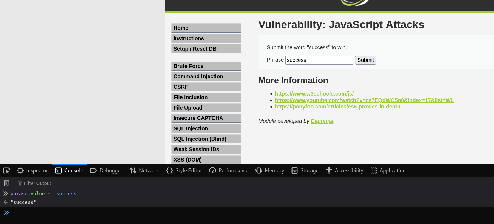
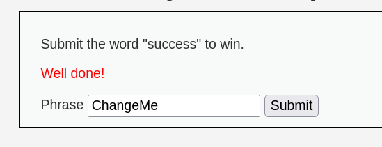
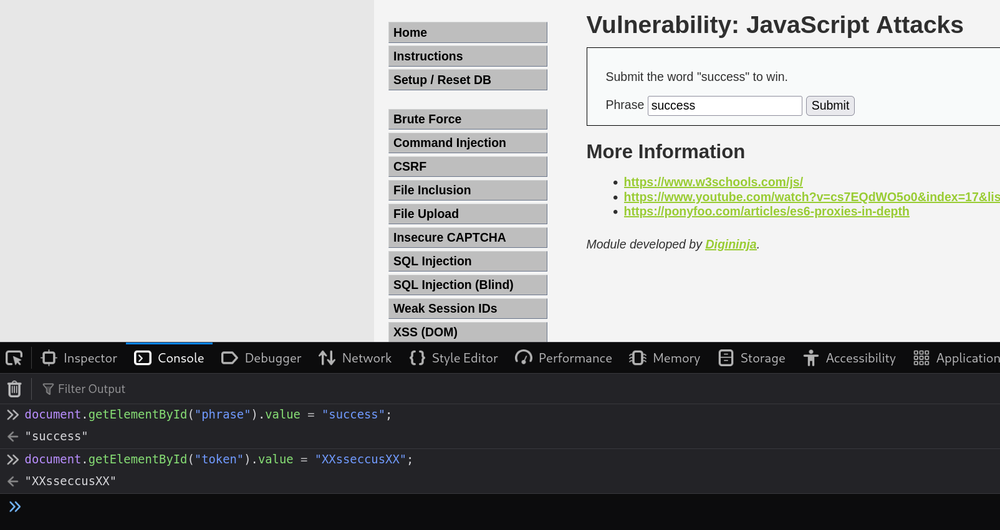
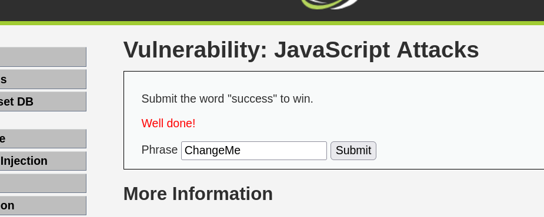

# 8. JavaScript Attacks - DVWA

El objetivo de esta práctica es evadir las protecciones basadas en JavaScript del lado del cliente. La aplicación nos reta a enviar la palabra "success" para ganar, pero el formulario genera un *token* dinámico de validación que debemos descifrar y manipular para que el servidor acepte nuestra petición.

## 1. Nivel LOW

### Análisis y explotación
En este nivel, el servidor espera recibir la palabra "success" junto con un *token* válido. Si analizamos el código JavaScript cargado en la página, descubrimos que el *token* se calcula aplicando la función criptográfica MD5 sobre el resultado de aplicar ROT13 a nuestra frase.

Aunque podemos calcular esto manualmente e interceptar la petición, lo más directo es utilizar la propia consola de herramientas de desarrollador del navegador para manipular las variables de JavaScript antes de enviar el formulario.

*Captura 1: Inyección directa en la consola del navegador reasignando el valor de la variable phrase a 'success'.*

Al realizar este cambio y ejecutar el envío, el script de la página genera automáticamente el token válido por nosotros y lo manda al backend.

*Captura 2: Al enviar el formulario modificado, el servidor valida el token correctamente y nos devuelve el mensaje "Well done!".*

---

## 2. Nivel MEDIUM

### Análisis de la vulnerabilidad y evasión
En el nivel medio, la forma de generar los *token* cambia. Analizando los scripts cargados en el cliente, deducimos que el valor del token para cualquier palabra introducida corresponde a la cadena "XX", seguida de la palabra invertida, y terminando con "XX" nuevamente.

Para la palabra requerida ("success"), el proceso es:
1. Palabra invertida: "sseccus"
2. Construcción final: `XXsseccusXX`

Para evadir esta comprobación sin pasar por el formulario (que podría estar bloqueando ciertas entradas), abrimos la consola del navegador y forzamos ambos valores modificando los elementos directamente en el Document Object Model (DOM).

*Captura 3: Asignación manual a través de la consola de los valores exactos esperados por el servidor: "success" para el input phrase y "XXsseccusXX" para el token oculto.*

Al ejecutar la petición con los valores inyectados en el DOM, conseguimos evadir la validación.

*Captura 4: Ejecución exitosa del ataque en nivel medio tras la inyección de los valores correctos en el DOM.*