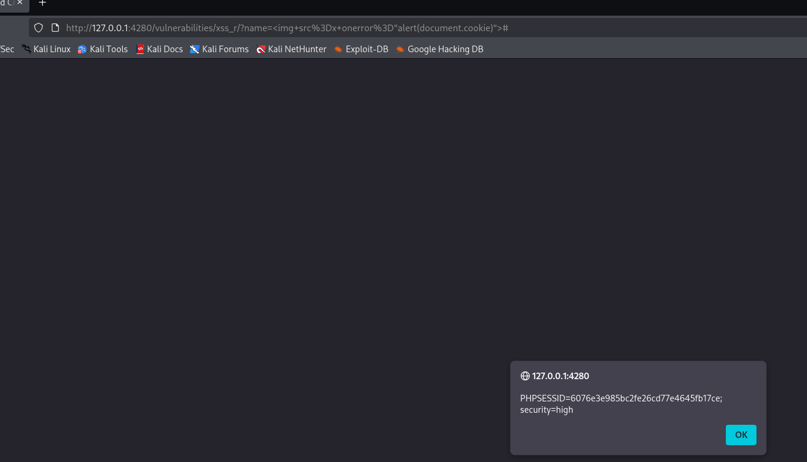

# 9. Reflected Cross Site Scripting (XSS) - DVWA

El objetivo de esta práctica es explotar una vulnerabilidad de Cross-Site Scripting Reflejado. Este tipo de XSS ocurre cuando la entrada proporcionada por el usuario es devuelta (reflejada) inmediatamente por la aplicación web sin ser saneada ni validada correctamente.

## Análisis de la vulnerabilidad y evasión (Niveles LOW, MEDIUM y HIGH)

Al analizar la página, vemos que cuenta con un campo de texto donde se nos pide introducir nuestro nombre, el cual luego se refleja en pantalla a través de un parámetro GET en la URL (`?name=`).

Aunque los niveles medio y alto implementan ciertas restricciones de seguridad (como bloquear o eliminar la palabra `<script>`), el desarrollador ha cometido el error de usar una "lista negra" incompleta. Podemos evadir todos los niveles de seguridad utilizando vectores de ataque alternativos basados en eventos HTML.

En lugar de intentar inyectar un script tradicional, inyectamos una etiqueta de imagen (``) apuntando a una ruta inexistente (`src=x`). Esto provoca un fallo de carga, lo que automáticamente dispara el manejador de errores de la imagen (`onerror`), ejecutando el código JavaScript que hayamos colocado en su interior.

* **Payload utilizado:** ``

Al enviar este payload en el campo del nombre, el servidor lo refleja en el código fuente de la página de respuesta. El navegador intenta cargar la imagen rota y, al fallar, ejecuta nuestra inyección.

*Captura 1: Explotación exitosa en el nivel de seguridad High. Se demuestra cómo la etiqueta de imagen evade los filtros del servidor, logrando que el navegador ejecute la alerta con la cookie de sesión de la víctima.*